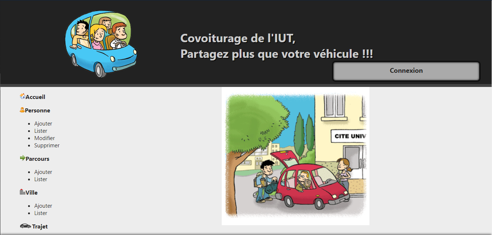

# Covoiturage de l'IUT 2020 :oncoming_automobile:  

*Dans le cadre du module M3104 (Programmation web côté serveur), nous devons réalisé un site de Covoiturage en PHP.* 

Réalisé par : Dorian CLERGERIE, Marie TACONET  
Enseignant encadrant : Michel CHASTAGNER  
Sujet/Enoncé/Source : https://gitlab.com/MiCha/covoit  
Date de réalisation (2 mois):  9 octobre 2020 - 13 décembre 2020  

